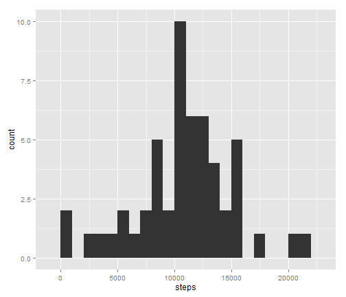
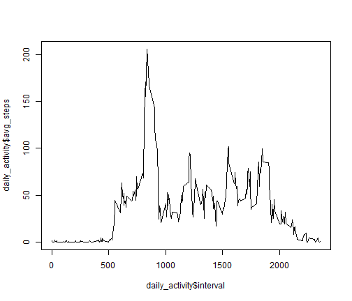
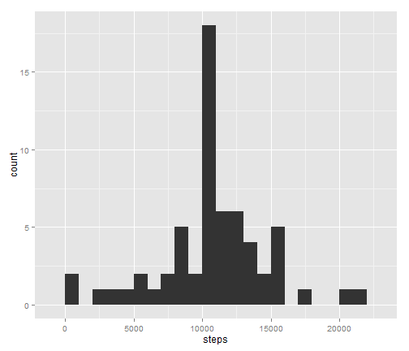
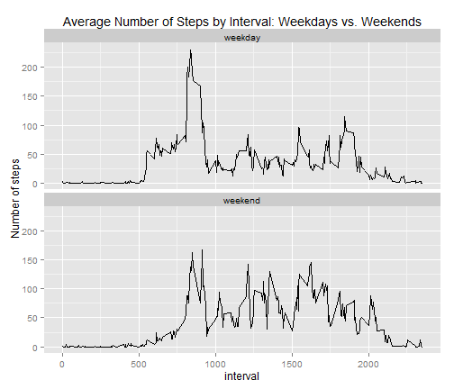

This report is based off of Activity monitoring data.  In this report, we seek to accomplish the following:

1. Loading and preprocessing the data
2. Summarizing the mean and median number of steps taken per day
3. Summarizing the daily activity pattern
4. Addressing missing values in the dataset
5. Summarizing differences in activity patterns between weekdays and weekends


##Part 1: Loading and preprocessing the data

First, we will load any necessary packages to do the intended analysis.

```r
library(ggplot2)
library(plyr)
library(dplyr)
```

```
## 
## Attaching package: 'dplyr'
## 
## The following objects are masked from 'package:plyr':
## 
##     arrange, count, desc, failwith, id, mutate, rename, summarise,
##     summarize
## 
## The following object is masked from 'package:stats':
## 
##     filter
## 
## The following objects are masked from 'package:base':
## 
##     intersect, setdiff, setequal, union
```

Next, we will load the dataset we are working with.  Please note that the zip file "activity.zip" is available on the GitHub website.  So, we just need to use read.csv function to read it in.


```r
data <- read.csv(unz("activity.zip","activity.csv"),stringsAsFactors=FALSE)
#Not converting strings to factors 


data <- data %>%
      mutate(date = as.Date(date,"%Y-%m-%d"))
#Converting date variable to date class, which will be useful for goal #5 listed above

glimpse(data)
```

```
## Observations: 17568
## Variables:
## $ steps    (int) NA, NA, NA, NA, NA, NA, NA, NA, NA, NA, NA, NA, NA, N...
## $ date     (date) 2012-10-01, 2012-10-01, 2012-10-01, 2012-10-01, 2012...
## $ interval (int) 0, 5, 10, 15, 20, 25, 30, 35, 40, 45, 50, 55, 100, 10...
```

```r
#Taking a first look at the dataset ("activity.csv" which we are now defining as data)
```


##Part 2: Summarizing the mean and median number of steps taken per day


Below is a histogram of the total number of steps taken per day.
Please note that we are currently ignoring missing values in the dataset by removing them entirely.

```r
steps_per_day <- data %>%
      filter(is.na(steps)==FALSE) %>%
      group_by(date) %>%
      summarize(steps = sum(steps))
#Removing any records with missing values of steps
#Before calculating the total number of steps taken per day
```


```r
qplot(steps,data=steps_per_day,binwidth=1000)
```

 


Again, ignoring missing values for now, the mean and median number of steps taken per day  are given below.


```r
mean(steps_per_day$steps)
```

```
## [1] 10766.19
```

```r
#Mean

median(steps_per_day$steps)
```

```
## [1] 10765
```

```r
#Median
```


##Part 3: Summarizing the daily activity pattern

Still ignoring missing values, below is a time-series plot of the number of steps taken by 5-minute interval, averaged across all days.


```r
daily_activity <- data %>%
      filter(is.na(steps)==FALSE) %>%
      group_by(interval) %>%
      summarize(avg_steps = mean(steps))
#Removing any records with missing values of steps
#Before calculating average number of steps by interval (across all days)
```


```r
plot(x=daily_activity$interval,y=daily_activity$avg_steps,type="l")
```

 

Below, we determine which 5-minute interval has the highest number of steps (averaged across all days).
We see that it is interval 835.


```r
daily_activity %>% filter(avg_steps==max(avg_steps))
```

```
## Source: local data frame [1 x 2]
## 
##   interval avg_steps
## 1      835  206.1698
```

```r
#Determining which interval has the highest average number of steps (across all days)
```

##Part 4: Addressing missing values in the dataset


Below is the number of missing values in the dataset:


```r
sum(is.na(data$steps))
```

```
## [1] 2304
```

```r
#Calculating the total number of missing values in the dataset
```

The strategy used to deal with missing values was to assign the average number of steps for the interval (if missing).
While relatively simple, we can see that the distribution of steps does not change all that much after addressing missing values in this fashion.
Below, we create a new dataset with the missing values filled in using the strategy described above.


```r
data_with_avg_by_interval <- left_join(data,daily_activity,by="interval")
#Merging on the average number of steps by interval 
#from Part 3 of the assignment

new_data <- data_with_avg_by_interval %>%
      mutate(steps=ifelse(is.na(steps)==TRUE,avg_steps,steps))
#Imputing missing values by assigning the average # of steps for the interval (across all days)
#if the original value was missing
```

As seen below, this strategy for filling in missing values had little effect on the distribution of steps.


```r
new_steps_per_day <- new_data %>%
      group_by(date) %>%
      summarize(steps = sum(steps))
#Calculating the total number of steps taken per day 
#for the new_data dataset


mean(new_steps_per_day$steps)
```

```
## [1] 10766.19
```

```r
#New mean

median(new_steps_per_day$steps)
```

```
## [1] 10766.19
```

```r
#New median

#Missing values have very little impact on the distribution of the number of steps per day
#Mean: Old = 10766.19, New = 10766.19
#Median: Old = 10765, New = 10766.19
```


```r
qplot(steps,data=new_steps_per_day,binwidth=1000)
```

 


##Part 5: Summarizing differences in activity patterns between weekdays and weekends

Below, we create a new factor variable called "weekend_ind" that indiciates whether day is weekend or weekday.


```r
new_data <- new_data %>%
      mutate(day = weekdays(date),
             weekend_ind = factor(ifelse(day=="Saturday"|day=="Sunday","weekend","weekday")))
```

Below, we determine the average number of steps by weekend indicator and interval and create a panel plot that illustrates the difference in activity patterns between weekdays and weekends.


```r
steps_by_weekend_ind <- new_data %>%
      group_by(weekend_ind,interval) %>%
      summarize(avg_steps = mean(steps))
#Averaging number of steps by each combination of weekend_ind and interval
```


```r
ggplot(steps_by_weekend_ind,aes(interval,avg_steps)) + geom_line() + facet_wrap(~weekend_ind,nrow=2) +
      ylab("Number of steps") + ggtitle("Average Number of Steps by Interval: Weekdays vs. Weekends")
```

 

```r
#Creating panel plot that shows how daily activity differs between weekdays and weekends
#Using ggplot2 plotting system
```

